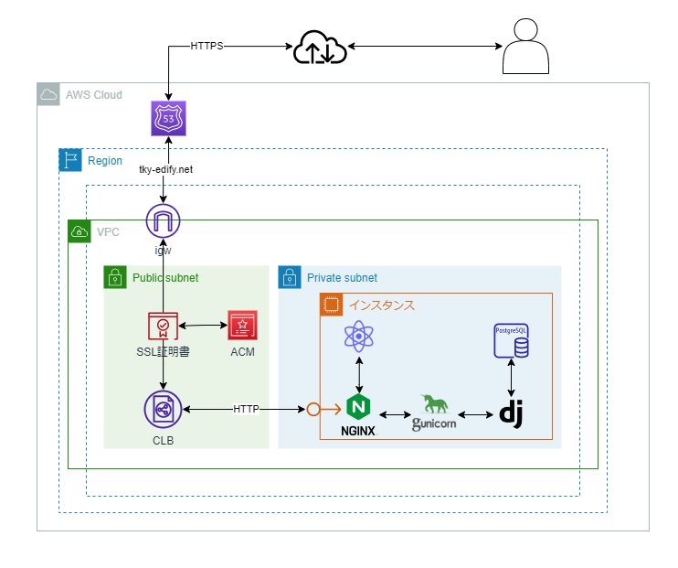

# 

## ～学校ポータルシステム～

## 概要

**「学校機能をこの１つに」** をコンセプトに開発した、学校ポータルシステムです。  
リンクはこちら > [Edify](https://tky-edify.net/)

## 企画～設計

### 制作背景

私たちが通う大原学園グループの東京情報クリエイター工学院専門学校では、学校機能のために様々なシステムや方式を併用している。  
| 学園単位の連絡 | クラス単位の連絡・チャット | 学生証及び本人確認 (図書の貸出等) |
| :----: | :----: | :---: |
| 「大原ポータル」 ※大原独自のシステム | Microsoft Teams | 紙媒体 |

これでは互換性もなければ、一日に複数のシステムを立ち上げて都度情報を確認する必要がある。そこで、学校の機能を一つにまとめることを目的として開発を決めた。また同時に学生証や教職員証もデジタル化することで持ち運びや紛失のリスクを低減し、認証機能として今後追加で開発し、応用していくことができる。

### 企画・設計・テスト等のドキュメント

[ドキュメントフォルダ URL](https://drive.google.com/drive/folders/1LmHyW1SuzeSJPZgcPlK0m9EiBsljIuQo?usp=sharing)

## 詳細

### アカウントの種類

- 管理者(admin): グループ全体を管理する
- 教員(teacher): 学生を管理し、学生や教員同士でのチャット及び掲示板への投稿が利用できる
- 学生(student): 学生証機能やチャット、掲示板の閲覧などが利用できる

## 機能詳細

1. グループを作成する(管理者のアカウント登録)  
   グループは、「○○ 大学」「○○ 学園」といった括りを指す
2. 学校を登録する(管理者アカウントでのみ可能)  
   学校は、「○○ キャンパス」「○○ 校」といった括りを指す
3. 教員の登録(管理者アカウントでのみ可能)
4. 学生の登録(教員アカウントでのみ可能)
5. 教職員証及び学生証の表示
6. 5 における本人認証 QR コードの表示とその認証
7. 掲示板への投稿及び閲覧(投稿・変更・削除は教員アカウントでのみ可能)
8. 学生同士・教員同士・学生と教員の個人チャット
9. その他情報変更など

## 使用技術

### 言語

- Python3.10.4
- JavaScript Node.js16.14.0
- その他: HTML5/CSS3

### フレームワーク

- Django3.2.16

### 主要なライブラリ

- NumPy
- Rest_framework
- Djoser
- React
- Redux
- Axios

### クラウド・サーバー技術

- Amazon EC2
- AWS EIP
- Amazon Route 53
- AWS Certificate Manager
- Gunicorn
- nginx

クラウドの構築図：  

### 開発環境

- Visual Studio Code
- Git/GitHub
- Postman
- Tera Term

### 組織ツール

- Microsoft Teams
- Microsoft To Do
